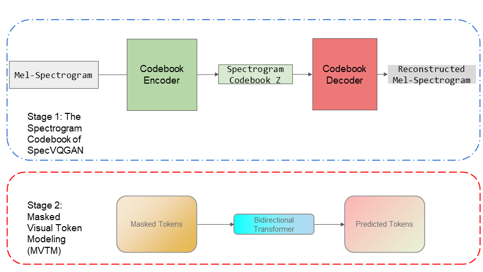

# Model Instruction

## Overview

<p align="center">

</p>


## Environment Preparation
Here we use the environment provided by [SpecVQGAN](https://github.com/v-iashin/SpecVQGAN#environment-preparation).

## Conda
```bash
conda env create -f conda_env.yml
```
Test your environment
```bash
conda activate specvqgan
python -c "import torch; print(torch.cuda.is_available())"
# True
```

## Data
The VAS dataset is downloaded under SpecVQGAN's [data](https://github.com/v-iashin/SpecVQGAN#data) instruction.

### Code
```bash
cd ./data
# 24GB
bash ./download_vas_features.sh
```
Only the Spectrum file under `vas/baby/melspec_10s_22050hz/` is used in our model.

## Pretrained and Trained Models
The no-feats pretrained SpecVQGAN model is used as our pretrained vqgan model.
* Model: [2021-06-20T16-24-38_vas_transformer]('https://a3s.fi/swift/v1/AUTH_a235c0f452d648828f745589cde1219a/specvqgan_public/models/2021-06-20T16-24-38_vas_transformer.tar.gz')

Our Model after training:
* [transformer_epoch_39.pt](/audio_model/checkpoints/transformer_epoch_39.pt)


## Training
```bash
python ./training_transformer.py --batch-size=8 --num-codebook-vectors=265 --epochs=40 --image-channels=1`
```

## Testing and Visualization

```bash
python ./visual_example.py --batch-size=1 --num-codebook-vectors=265 --epochs=40 --image-channels=1 
```


## Reference

```
@InProceedings{SpecVQGAN_Iashin_2021,
  title={Taming Visually Guided Sound Generation},
  author={Iashin, Vladimir and Rahtu, Esa},
  booktitle={British Machine Vision Conference (BMVC)},
  year={2021}
}

@article{chang2022maskgit,
  title={MaskGIT: Masked Generative Image Transformer},
  author={Chang, Huiwen and Zhang, Han and Jiang, Lu and Liu, Ce and Freeman, William T},
  journal={arXiv preprint arXiv:2202.04200},
  year={2022}
}
```
#### Githubs:
1. https://github.com/v-iashin/SpecVQGAN
2. 
